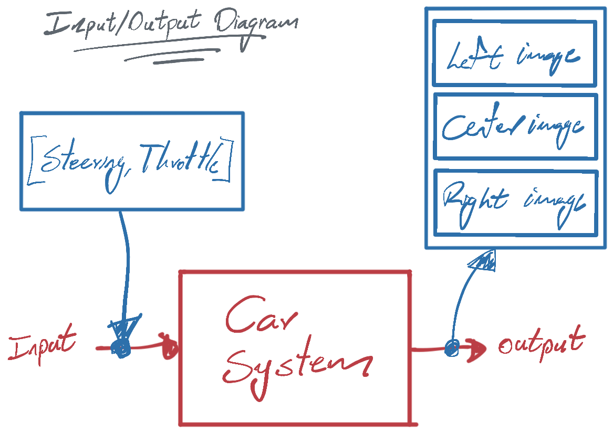

# Behavioral Cloning #

## Introduction. ##
This project has the main purpose to drive a car using the concepts learned with Keras and Deep Neuronal Networks, through the Udacity Self Drivin Car emulator. The input and output data comes from the manual mode inside the emulator, representing the actions of the user who drives the car and the idea is to get a way to "train" a system able to do this job. For this reason, this project receives the name Behavioral Cloning.

The goals of this project are the following:
* Use the simulator to collect data of good driving behavior
* Build, a convolution neural network in Keras that predicts steering angles from images
* Train and validate the model with a training and validation set
* Test that the model successfully drives around track one without leaving the road
<!-- * Summarize the results with a written report -->

## How to get and run emulator? ##
This project requires to download the emulator available for Windows, Linux: [self-driving-car-sim](https://github.com/udacity/self-driving-car-sim/releases).

Mac users need to use another repository due the missing updates in the code, so I found this usefull repository that contains an available version of the emulator for MacOS Catalina:
[CarND-MacCatalinaSimulator](https://github.com/endymioncheung/CarND-MacCatalinaSimulator).

The emulator is a executable program. So, it doesn't require any compilation process.

<!-- ## How the environment was setup to get the results? -->


[//]: # (Image References)

[image1]: ./examples/placeholder.png "Model Visualization"
[image2]: ./examples/placeholder.png "Grayscaling"
[image3]: ./examples/placeholder_small.png "Recovery Image"
[image4]: ./examples/placeholder_small.png "Recovery Image"
[image5]: ./examples/placeholder_small.png "Recovery Image"
[image6]: ./examples/placeholder_small.png "Normal Image"
[image7]: ./examples/placeholder_small.png "Flipped Image"

## Rubric Points ##
The following are the rubrics considered for this project: [Rubric points](https://review.udacity.com/#!/rubrics/432/view).

## Files included in this project ##

This project includes the following files:
* model.py containing the script to create and train the model.
* drive.py for driving the car in autonomous mode.
* model.h5 containing a trained convolution neural network.

## How to run the project
After get running the Udacity emulator, we need the following line of code to run in a terminal with the respective model generated to show the result:
```sh
python drive.py model.h5
```

# How this project was developed? #
## Considerations ##
- The main purpose of this project is to drive a car on a track, so in this context, the car is the system that needs to be controlled or driven. 
- To drive the car, we have two inputs for the car system: steering, and throttle.
- When the car is driven, it provides information about their position inside the track throught three images provided by the left, center and right camera.
- The steering and throttle introduced in the car, generates left, center and right images. The following image is a better representation about this system:
  
  

- The idea is to use a feedback system able to drive the car (The Neuronal Network), able to receive the images as input to generate the Steering value. Throttle will be a constant value for practical purposes.
- Left, Center and Right images are used for the training process, but only the Center one will be considered as the input for our network.

## Files management for different scenarios
The first step to develop this work was define an strategy to manage the information provided by the emulator. So, after understanding how the emulator works and how to export data generated after drive the car in manual mode using the record button, different experiments were made to get input/output data. The input data is the image captured by the car, and the ouput data is the steering value asociated. 

- The first consideration to manage different scenarios, was try to put all of them in the same files, playing with the record and pause button after do the specif experiment, trying to store all information in the same `IMG` folder and `data_driven.csv` file. This process result complicated and avoid to reuse or remove specific group of images asociated with the experiment, due the amount of data collected, because find the specific images and values could be a worst way to do it.
- The next consideration was to get the data of the specific scenario in a single session inside the emulator. So, when the data is collected after do the specific experiment, the manual mode is stopped, and the `IMG` folder and `driving_log.csv` are renamed according to the number of the experiment idenfied, so the nomenclature for the image folder and `.csv` file was defined as respectively: `IMG<number>` and `driving_log<number>.csv`. As an example, for the experiment `3`, the files generated was renamed as `IMG3` and `driving_log3.csv`.

## Read data before train the model

Based on the last justification, the files was readed with the follogin function:
```Python
import csv

# dataPath: folder path where all IMG's and driving_log's are stored
dataPath = 'data'

# filename: path asociated with the specific csv file that contains the relation between images an values (driving_log).
# local_lines : list of all rows in the csv file. Each row have information about the image paths and values (list of lists).
def read_lines_from_filename(filename):
    local_lines = []
    with open('./{}/{}'.format(dataPath, filename)) as csvfile:
        reader = csv.reader(csvfile)
        for line in reader:
            local_lines.append(line)
    return local_lines
```

And a iteration over a dictionary was used to read each experiment, as follows:
```Python
driving_log_list = {'driving_log.csv':'IMG', 'driving_log2.csv':'IMG2'}

for (d_log, folder) in driving_log_list.items():
    print('Reading file: {}'.format(d_log))
    lines = read_lines_from_filename(d_log)

    for line in lines:
        # read paths an values stored in the line list
```

This method was included in the final script, model.py.

## Model Architecture
In this project, two model arquitecture was tested:
- LeNet
 


- Nvidia


Lenet was the first approach used. When it was used, present some issues with stability. So the second model correspond to the nvidia approach, which have a nice documentation in the following link: [End-to-End Deep Learning for Self-Driving Cars](https://developer.nvidia.com/blog/deep-learning-self-driving-cars/). The last one provides more stability using the correct data to train the model.

## Multiple image approach ##
Left, Center and Right images are used for the training process, but only the Center one will be considered as the input for our network. This approach comes from the following image provided by the udacity Nanodegree course:


This aproach was implemented in the script as follows:
```Python
# lines: array that contains each row of the csv file
# line: row that contains the image path for images, and also the steering and throttle values associated.
# images: global array that contains all the images used to train the model as the input
# measurements: global array that contains all measurements used to train the model as the output
# correction: a parameter that needs to be tuned. It provides a correction in the scenario when the car sees the lane lines.
for line in lines:
    steering_center = float(line[3])
    steering_left = steering_center + correction
    steering_right = steering_center - correction

    image_center = get_image_from_sourcepath(line[0], folder)
    image_left = get_image_from_sourcepath(line[1], folder)
    image_right = get_image_from_sourcepath(line[2], folder)
    
    images.extend([image_center, image_left, image_right])
    measurements.extend([steering_center, steering_left, steering_right])
```

## Scenarios considered ##
The following are the scenarios cosidered to get the data to train the models:
- Centering Scenario: Driving car on the center of the lane, one lap, on default direction.

   

- Opposite Scenario: Driving car on the center of the lane, one lap, on opposite direction.
  
   

- ZigZag Scenario: Driving car in curved zig-zag way, respect to the lane, one lap, on default direction.
  
   

## Data augmentation ##
Images readed was flippered horizontally to add improve the model, with their measurement inverted in sign. This implementation is made due the car in a track, always turn on one side more ofthen than the other one, so we use this strategy to generalize the model. The following code is an example about how this approach was implemented:

```Python
import numpy as np
image_flipped = np.fliplr(image)
measurement_flipped = -measurement
```

## Evolution of the code ##
The evolution of the final code is showed on files `read_and_traing_*.py` that was based on the instructions and documentation provided in the course:

- read_and_train_1.py: This script was the entry point to read and train a basic model. The input data used to train the model was the Centering Scenario.
- read_and_train_2.py: This script uses a lambda layer to convert images from color to gray, calculating the mean for each pixes position in each rgb channel.
- read_and_train_3.py: This script uses the LeNet architecture, 


## Some r ##


<!-- ## Model Architecture and Training Strategy

#### 1. An appropriate model architecture has been employed

Mentioned earlier, the Nvidia model arquitecture was defined, and the visualization of how it looks is presented in the following image:


My model consists of a convolution neural network with 3x3 filter sizes and depths between 32 and 128 (model.py lines 18-24) 

The model includes RELU layers to introduce nonlinearity (code line 20), and the data is normalized in the model using a Keras lambda layer (code line 18). 

#### 2. Attempts to reduce overfitting in the model

To avoid overfitin in the model, and help the car to turn on curves correctly, was include data doing zig-zags on the track, and passing this data to the model. We can see in the following table, the results before include this information, and when it was included. The results shows a better performance, so it its consistent to get a better way to get a generalizaed model.

The model contains dropout layers in order to reduce overfitting (model.py lines 21). 

The model was trained and validated on different data sets to ensure that the model was not overfitting (code line 10-16). The model was tested by running it through the simulator and ensuring that the vehicle could stay on the track.

#### 3. Model parameter tuning

The model used an adam optimizer, so the learning rate was not tuned manually (model.py line 25).

#### 4. Appropriate training data

Training data was chosen to keep the vehicle driving on the road. I used a combination of center lane driving, recovering from the left and right sides of the road ... 

For details about how I created the training data, see the next section. 

### Model Architecture and Training Strategy

#### 1. Solution Design Approach

The overall strategy for deriving a model architecture was to ...

My first step was to use a convolution neural network model similar to the ... I thought this model might be appropriate because ...

In order to gauge how well the model was working, I split my image and steering angle data into a training and validation set. I found that my first model had a low mean squared error on the training set but a high mean squared error on the validation set. This implied that the model was overfitting. 

To combat the overfitting, I modified the model so that ...

Then I ... 

The final step was to run the simulator to see how well the car was driving around track one. There were a few spots where the vehicle fell off the track... to improve the driving behavior in these cases, I ....

At the end of the process, the vehicle is able to drive autonomously around the track without leaving the road.

#### 2. Final Model Architecture

The final model architecture (model.py lines 18-24) consisted of a convolution neural network with the following layers and layer sizes ...

Here is a visualization of the architecture (note: visualizing the architecture is optional according to the project rubric)

![alt text][image1]

#### 3. Creation of the Training Set & Training Process

To capture good driving behavior, I first recorded two laps on track one using center lane driving. Here is an example image of center lane driving:

![alt text][image2]

I then recorded the vehicle recovering from the left side and right sides of the road back to center so that the vehicle would learn to .... These images show what a recovery looks like starting from ... :

![alt text][image3]
![alt text][image4]
![alt text][image5]

Then I repeated this process on track two in order to get more data points.

To augment the data sat, I also flipped images and angles thinking that this would ... For example, here is an image that has then been flipped:

![alt text][image6]
![alt text][image7]

Etc ....

After the collection process, I had X number of data points. I then preprocessed this data by ...


I finally randomly shuffled the data set and put Y% of the data into a validation set. 

I used this training data for training the model. The validation set helped determine if the model was over or under fitting. The ideal number of epochs was Z as evidenced by ... I used an adam optimizer so that manually training the learning rate wasn't necessary. -->


## Additional resources ##
[1] Convert videos to gif: https://ezgif.com/

[2] Resize images: https://resizeimage.net/
